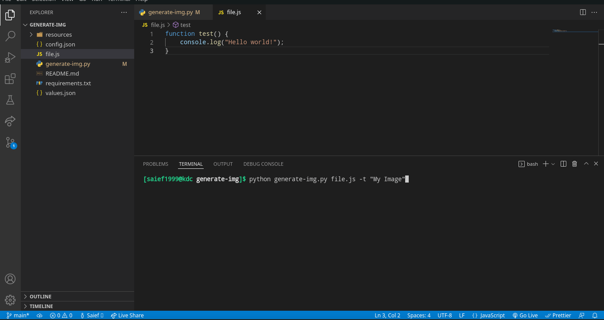

# Code Image Generator

## Overview

Generate images from code using `Ray.so`.



## Usage 

Start by downloading requirements : `pip install -r requirements.txt`

and then run the script

```bash
generate-img.py [-h] [-t TITLE] [-c CONFIG] src
```

Options:
- `-h,--help` : show help message and exit
- `-t,--title TITLE` : image title (default: undefined)
- `-c,--config CONFIG` : config file path (default: config.json)